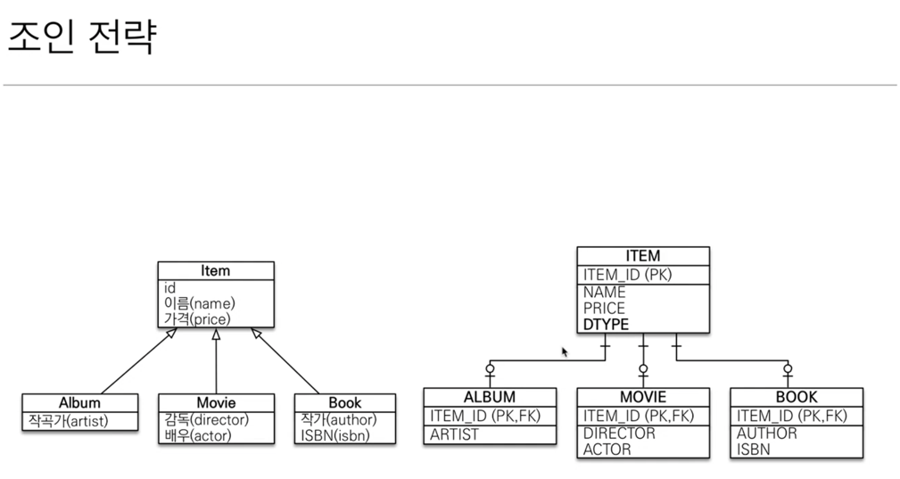
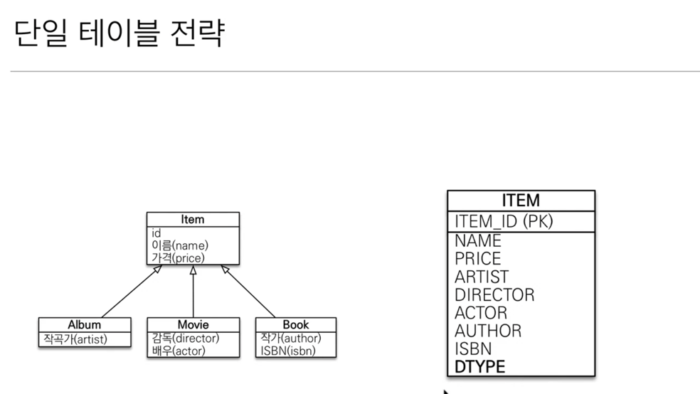
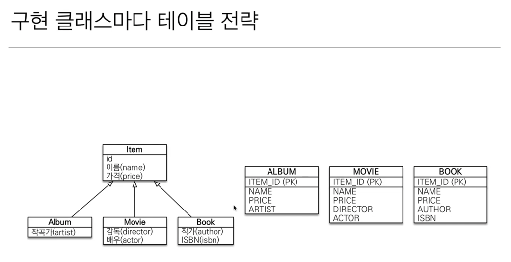

# 상속관계 매핑

- 관계형 데이터베이스는 상속 관계가 없음
- `슈퍼타입, 서브타입` 관계라는 모델링기법이 그나마 객체 상속과 유사
- 상속관계 매핑: 객체의 상속 구조와 DB의 슈퍼타입 서브타입 관계를 매핑

## 실제 물리 모델로 구현하는 방법

### 1. 각각 테이블로 변환 (조인 전략)
   

- 실제 상속 구조와 가깝게 구현해서 가져올땐 JOIN으로 가져오기
- 가장 정석적인 방법이라고 볼 수 있음

- 장점
  - 테이블 정규화
  - 외래 키 참조 무결성 제약조건 활용가능
  - 저장공간 효율화
  
- 단점
  - 조회시 조인을 많이사용,성능저하
  - 조회 쿼리가 복잡함
  - 데이터 저장시 INSERT SQL 2번 호출

### 2. 통합 테이블로 변환 (단일 테이블 전략)

- 논리 모델을 한 테이블로 합쳐버리기
- 다른 여러 필드들을 한 테이블안에 때려 넣음
- @DiscriminatorColumn 생략해도 알아서 DTYPE column 만들어줌 (꼭 필요하기 때문에)

- 장점
  - 조인이 필요 없으므로 일반적으로 조회 성능이 빠름
  - 조회 쿼리가 단순함 
    
- 단점
  - 자식 엔티티가 매핑한 컬럼은 모두 null 허용
  - 단일 테이블에 모든것을 저장하므로 테이블이 커질수있다. 상황에 따라서 조회 성능이 오히려 느려질 수 있다. 
    (이렇게 되려면 어느정도 임계점을 넘어야함. 근데 그럴 일은 거의 없음)

### 3. 서브타입 테이블로 변환 (구현 클래스마다 테이블 전략)

- 중복되는 필드 신경쓰지 않고 각각 테이블 만들어 주기

- 장점
  - 서브 타입을 명확하게 구분해서 처리할 때 효과적
  - not null 제약조건 사용 가능

- 단점
  - 이 전략은 데이터베이스 설계자와 ORM 전문가 둘 다 추천X!
    - 뭔가 묶어낼 부분이 없음 (e.g. price 컬럼을 통해 정산하고 싶을 때, 각 테이블별로 다 해줘야함)
    - 부모 타입으로 find 하고자 할 때 상속 받은 모든 테이블에 쿼리를 날려서 UNION 해서 가져옴 (비효율적)
    - 스키마 변경이 있어야할 때 불리함
  - 여러 자식 테이블을 함께 조회할 때 성능이 느림(UNION SQL 필요)
  - 자식 테이블을 통합해서 쿼리하기 어려움

### JOIN 전략을 기본적으로 깔기 + 상속구조가 단순할 경우 단일 테이블!

## 주요 어노테이션

- @Inheritence(strategy=InheritanceType.xxx)
    - JOINED: 조인 전략
    - SINGLE_TABLE: 단일 테이블 전략 (default 전략)
    - TABLE_PER_CLASS: 구현 클래스마다 테이블 전략
- @DiscriminatorColumn(name="DTYPE")
- @DiscriminatorValue("XXX")

