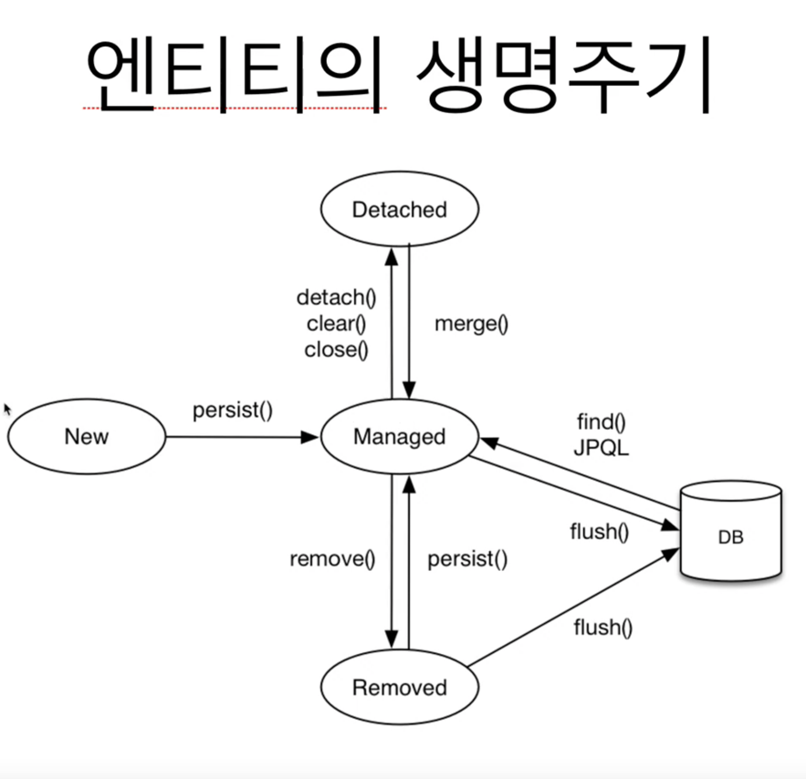

# Persistence Context (영속성 컨텍스트)

**엔티티를 영구 저장하는 환경**

`enttiy manager`를 통해서 영속성 컨텍스트에 접근

## entity의 생명주기

- 비영속(new/transient)
영속성 컨텍스트와 전혀 관계가 없는 새로운 상태
  
- 영속(managed)
영속성 컨텍스트에 관리되는 상태
  
- 준영속(detached)
영속성 컨텍스트에 저장되었다가 분리된 상태
  
- 삭제(removed)
삭제된 상태
즉, db에 delete 쿼리를 날리고 싶을 때
  
## 영속성 컨텍스트의 이점

- 1차캐시
단, 동일한 트랜잭션 안에서!
  
- 동일성(identity) 보장

- 트랜잭션을 지원하는 쓰기지연 (transactional write-behind)

- 변경 감지 (Dirty Checking)

- 지연 로딩 (Lazy Loading)

## 준영속 상태

- 영속 -> 준영속
- 영속 상태의 엔티티가 영속성 컨텍스트에서 분리 (detached)
- 이제 영속성 컨텍스트에서 관리하지마
- 영속성 컨텍스트가 제공하는 기능을 사용 못 함

## 준영속 상태로 만드는 방법
- em.detach(entity)
특정 엔티티만 준영속 상태로 전환

- em.clear()
영속성 컨텍스트를 완전히 초기화

- em.close()
영속성 컨텍스트를 종료

## 환경에 따른 엔티티 매니저와 영속성 컨텍스트 cardinality 
J2SE 환경
엔티티 매니저와 영속성 컨텍스트가 1:1

J2EE, 스프링 프레임워크 같은 컨테이너 환경
엔티티 매니저와 영속성 컨텍스트가 N:1