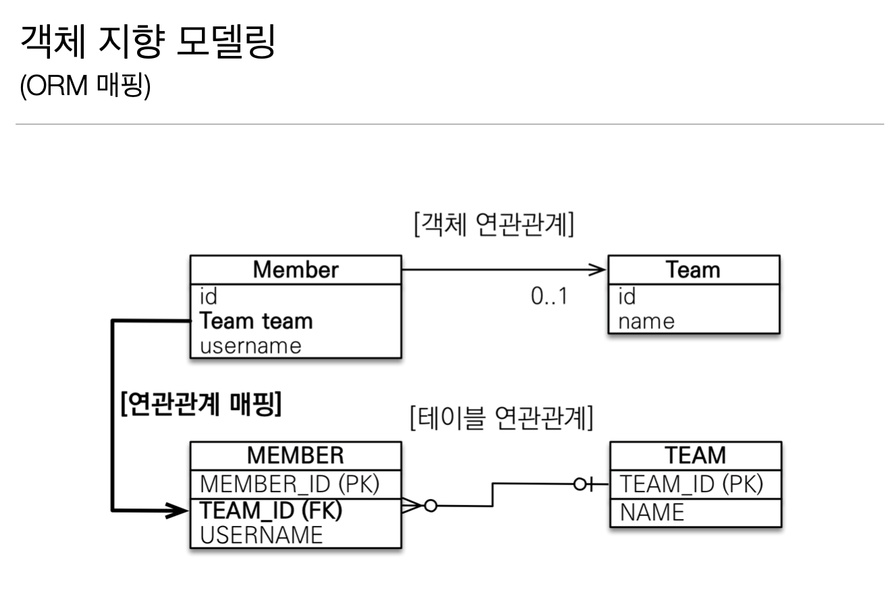
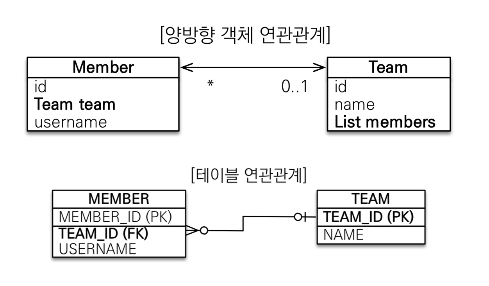
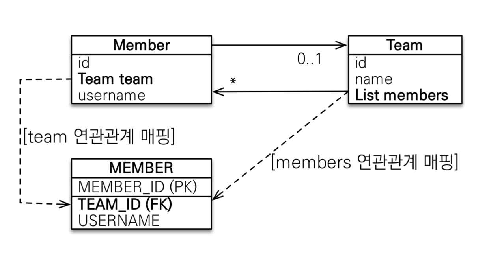

# 연관관계 매핑

## 단방향 연관관계


- 한 Entity가 다른 Entity를 참조 (단방향으로)

## 양방향 연관관계와 연관관계 주인



- Entity 두 개가 서로를 참조
- 객체는 가급적 단방향이 좋음
  
### 객체의 양방향 연관관계
- 객체의 양방향 관계는 사실 양방향 관계가 아니라 `서로 다른 단방향 관계 2개`다
- 즉, 양방향으로 참조하려면 단방향 연관관계 2개를 만들어야 함

```
class A {
    B b
}

class B {
    A a
}
```


### 테이블의 양방향 연관관계
- 테이블은 외래 키 하나로 두 테이블의 연관관계를 관리
- FK만 있으면 양쪽으로 JOIN 가능

```
SELECT *
FROM MEMBER M
JOIN TEAM T ON M.TEAM_ID = T.TEAM_ID

SELECT *
FROM TEAM T
JOIN MEMBER M ON T.TEAM_ID = M.TEAM_ID 
```

### 둘 중 하나로 외래키를 관리해야함



- 둘 중 뭘로 매핑해야해?
- member를 바꾸고 싶을 때 (새로운 팀에 들어가고싶을 때)
- member의 team값을 바꿔야할 지 Team에 있는 members 에 있는 값을 건드려서 team을 바꿔야할 지
- 외래키를 어떻게 업데이트 해야하지?
- 둘 중 하나를 주인 (foreign key 관리자)으로 삼아야함

### 연관관계의 주인 (Owner)

**양방향 매핑 규칙**

- 객체의 두 관계중 하나를 연관관계의 주인으로 지정
- 연관관계의 주인만이 외래 키를 관리(등록, 수정)
- 주인이 아닌쪽은 읽기만 가능
- 주인은 mappedBy 속성 사용 X
- 주인이 아니면 mappedBy 속성으로 주인 지정

### 누구를 주인으로 해야할까

- **비즈니스 로직을 기준으로 연관관계의 주인을 선택하면 안됨!**
- 외래키가 있는 곳을 주인으로 (위의 경우에는 Member)
- 다대일 중 `다`가 주인
- 진짜 매핑: 연관관계의 주인 (Member.team)
- 가짜 매핑: 주인의 반대편 (Team.members)
- 주인이 아닌 객체는 `읽기`만 됨

### 양방향 매핑시 가장 많이 하는 실수

- 연관관계 주인에 값을 입력하지 않음

```
Team team = new Team();
team.setName("TeamA");
em.persist(team);

Member member = new Member();
member.setName("member1");
//member.setTeam(team) 이 없음

//역방향(주인이 아닌 방향)만 연관관계 설정
// team의 members는 읽기 전용이므로 db에서 안씀
team.getMembers().add(member);

em.persist(member);

// 결과적으로 member 의 외래키 (team_id)는 null이 들어감
```

- 양방향 매핑일 때는 순수 객체상태를 고려해서 양쪽에 값을 다 넣어주는게 좋음
  
- 연관관계 편의 메서드를 생성하자
  
```
public void setTeam()(Team team) {
    this.team = team;
    team.getMembers().add(this);
}
```
- 양방향 매핑시 무한루프 조심!
  - toString(), lombok, JSON 생성 라이브러리 
  - Controller에서 Entity를 절대 반환하지 말 것, DTO 사용)
  
## 정리

- 처음에는 되도록 단방향 매핑으로 설계를 완료할 것
- 단방향 매핑만으로도 이미 연관관계 매핑은 완료된 것
- 양방향 매핑은 반대 방향으로 조회(객체 그래프 탐색) 기능이 추가된 것 뿐
- JPQL에서 역방향으로 탐색할 일이 많음
- **단방향 매핑을 잘하고 양방향 매핑은 필요할 때 추가하면 됨**

## 연관관계 매핑시 고려사항 3가지
- 다중성
  - 다대일, 일대다, 일대일, 다대다  
  - 다대다는 실무에서 안쓴다!

- 단방향, 양방향
  - 테이블: 방향개념이 없음. 외래키 하나로 양쪽 JOIN 가능
  - 객체: 참조용 필드가 있는 쪽으로만 참조가능. 한쪽만 참조하면 `단방향`, 양쪽이 서로 참조하면 `양방향`
  
- 연관관계의 주인

## 다대일

| attribute | description | default |
|:----:|:---|:---:|
|optional |false로 설정하면 연관된 엔티티가 항상 있어야 한다.|TRUE |
|fetch |글로벌 페치 전략을 설정한다.| - @ManyToOne=FetchType.EAGER <br> - @OneToMany=FetchType.LAZY|
|cascade | 영속성 전이 기능을 사용한다. | |
|targetEntity |연관된 엔티티의 타입 정보를 설정한다. 이 기능은 거 의 사용하지 않는다. 컬렉션을 사용해도 제네릭으로 타 입 정보를 알 수 있다.| |

## 일대다

| attribute | description | default |
|:----:|:---|:---:|
|mappedBy | 연관관계의 주인 필드를 선택한다.| | 
|fetch | 글로벌 페치 전략을 설정한다. | - @ManyToOne=FetchType.EAGER <br> - @OneToMany=FetchType.LAZY|
|cascade| 영속성 전이 기능을 사용한다. | |
|targetEntity | 연관된 엔티티의 타입 정보를 설정한다. 이 기능은 거 의 사용하지 않는다. 컬렉션을 사용해도 제네릭으로 타 입 정보를 알 수 있다.| |

### 일대다 단방향
- 일대다 단방향 매핑 단점
  1. 엔티티가 관리하는 외래 키가 다른 테이블에 있음 (Team이 team_id를 관리하는데 외래키는 member의 team_id에 있음)
  2. 연관관계 관리를 위해 추가로 UPDATE query 날라감
- 차라리 `다대일로 양방향`으로 갈 것!
- 일대다 단방향에서 @JoinColumn을 사용하지 않으면 조인 테이블 방식을 사용함 (중간에 테이블을 하나 자동으로 추가함) 

### 일대다 양방향

- @JoinColumn(insertable=false, updatable=false) 
- 읽기 전용 필드를 사용해서 양방향 처럼 사용
- 걍 다대일 양방향을 사용하자

## 일대일

- 주 테이블이나 대상 테이블 중에 외래키 선택 가능
- 대상 테이블에 외래키 단방향은 JPA에서 지원 안됨

- 주 테이블에 외래 키
  - 주 객체가 대상 객체의 참조를 가지는 것 처럼 주 테이블에 외래 키를 두고 대상 테이블을 찾음
  - 객체지향 개발자 선호
  - JPA 매핑 편리
  - 장점: 주 테이블만 조회해도 대상 테이블에 데이터가 있는지 확인 가능
  - 단점: 값이 없으면 외래 키에 null 허용 
    
- 대상 테이블에 외래 키
  - 대상 테이블에 외래 키가 존재
  - 전통적인 데이터베이스 개발자 선호 (DBA)
  - 장점: 주 테이블과 대상 테이블을 일대일에서 일대다 관계로 변경할 때 테이블 구조 유지
  - 단점: 프록시 기능의 한계로 지연 로딩으로 설정해도 항상 즉시 로딩됨 (프록시는 뒤에서 설명)

## 다대다

- RDB는 정규화된 테이블 2개로 다대다 관계를 표현할 수 없음
- 연결 테이블을 추가해서 일대다, 다대일 관계로 풀어내야함
- 편리해 보이지만 실무에서 사용 x
- 연결 테이블이 단순히 연결만 하고 끝나지 않음
- 주문 시간, 수량같은 데이터가 들어올 수 있음

### 다대다 한계 극복

- 연결 테이블용 엔티티 추가 (연결 테이블을 엔티티로 승격)
- @ManyToMany -> @OneToMany, @ManyToOne
- 이 때 `일`쪽의 ID두개를 조합한 PK를 쓰는 것 보다, 단독적인 (의미없는?) auto increment ID를 사용하는 것이 더 변화에 유연하고 쉬움

## @JoinColumn

- 외래 키를 매핑할 때 사용

| attribute | description | default |
|:----:|:---|:---:|
|name| 매핑할 외래 키 이름 | 필드명 + _ + 참조하는 테 이블의 기본 키 컬럼명|
|referencedColumnName |외래 키가 참조하는 대상 테이블의 컬럼명 |참조하는 테이블의 기본 키 컬럼명|
|foreignKey(DDL) | 외래 키 제약조건을 직접 지정할 수 있다. 이 속성은 테이블을 생성할 때만 사용한다.| |
|unique nullable insertable updatable columnDefinition table | @Column의 속성과 같다.| |
