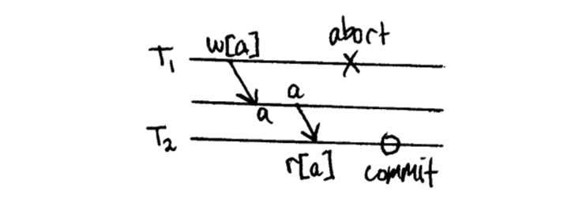
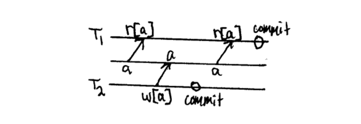
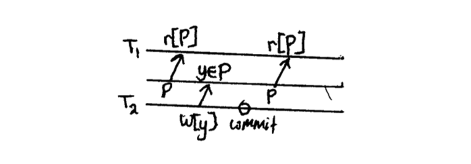

# 찜꽁 - 문제 해결 사례
## 찜꽁 소개
공간을 한눈에, 예약은 한 번에! 맞춤형 공간 예약 서비스 제작 플랫폼 찜꽁입니다.
`공간 관리자 (제공자)`는 에디터를 통해 공간을 생성할 수 있습니다. 생성한 공간은 링크를 통해 `공간 사용자 (예약자)`에게 제공될 수 있으며, 사용자는 링크를 통해 간편하게 공간을 확인하고 예약을 진행할 수 있습니다.

## 테스트 코드 리팩터링
- 문제 상황: 테스트 코드 로직에는 문제가 없는데, 테스트 순서에 따라 성공과 실패가 좌우되는 문제 상황. 게다가, 테스트 코드가 거대해져서 디버깅이 힘들어짐.
- 원인: 테스트 코드작성 시 필요한 테스트 픽스쳐들을 편의상 하나의 클래스 내부에 static field로 몰아넣어서 관리하고 있었음. 
  다수의 테스트들에서 이 fixture를 사용하다 보니 이 fixture에 변경을 주는 테스트가 있는 경우 다른 테스트가 터지는 문제가 발생. 
- 해결책: fixture 생성에 필요한 constants들만 하나의 클래스 내부로 몰아넣어서 관리하도록 리팩터링. 
  그리고 fixture들은 각 테스트별로 일일이 만들어줌. 
  각 layer별로 공유하는 픽스쳐들 중 변경의 여지가 없는 것들은 최상위 테스트 클래스 (e.g. AcceptanceTest, ServiceTest ...)로 옮겨서 최대한 픽스쳐 중복 제거.  
- 평가: 테스트 작성 시 불안하지 않고 안정감이 생김. 테스트 문제 상황 시 디버깅이 수월해짐. setUp 메서드와 문제가 있는 테스트 메서드 두 군데만 살펴보면 됨.

## 전략패턴 / 템플릿-콜백 패턴을 활용한 리팩터링
- 문제 상황: `공간 관리자`와 `공간 사용자`의 예약 서비스 클래스들 사이에서 코드 중복이 발생함
- 원인: 둘의 예약 서비스 로직이 거의 비슷하면서도 조금씩 다른 부분들이 있어서, 어쩔 수 없이 개별적으로 서비스 클래스를 두고 있었음
- 해결책: ‘전략패턴’을 활용함. 공간 관리자와 공간 사용자의 controller에서 각자의 전략들을 필드로 가지고 있도록 하고, 예약 서비스 CRUD 메서드 호출 시 전략을 주입해주도록 리팩터링함. 
  주입된 전략들은 ‘템플릿 - 콜백 패턴’에서의 콜백함수처럼 분기가 필요한 부분에서만 동작하게 함
- 평가: 불필요한 코드중복이 제거되고, 공간 관리자와 사용자의 예약 관련 서비스 로직을 하나 의 서비스 클래스로 처리할 수 있게 됨.
  또한, 다음에 예약 관련 서비스 로직이 변경되거나 확장되어야 할 때 더 유연하게 대처할 수 있는 구조를 가지게 됨

## timezone 이슈
- 문제 상황: Local PC에서는 잘 동작하는 예약 시간 validation 로직이 Production 상에서 제대로 수행되지 않거나,
  DB에 시간이 올바르게 저장되지 않는 등의 문제가 발생
- 원인: Local OS 환경과 Production OS 환경(AWS EC2)의 time zone 차이 (KST vs UTC)
- 해결책: 현재 시각이 필요한 비즈니스 로직에서 사용할 TimeConverter Interface를 만든 후,
  이를 ZonedDateTime 클래스를 활용해서 구현하는 LocalTimeConverter 와 ProductionTimeConverter 클래스를 통해 해결
- 평가: 단순히 time zone 문제를 해소했을 뿐만 아니라, Application 코드를 통해 Profile 마다 필요한 TimeConverter를 지정해 줌으로써 time zone에 따른 시차를 능동적으로 컨트롤할 수 있게 됨

# Transaction

## ACID
트랜잭션이 안전하게 수행된다는 것을 보장하기 위한 원칙

Atomicity (원자성): 트랜잭션 내부의 명령들은 모두 실행되거나 (commit) 하나라도 실패시 모두 실행되지 않아야한다 (rollback). 일부만 실행되어서는 안된다.

Consistency (일관성): DB의 상태, DB 내부의 계층관계, 컬럼의 속성등은 항상 일관되게 유지되야 함

Isolation (독립성): 트랜잭 수행 시, 다른 트랜잭션이 끼어들 수 없다. 각 트랜잭션은 독립적으로 수행되어야한다.

Durability (내구성): 트랜잭션이 성공적으로 수행되어 데이터가 커밋되었다면, 어떠한 문제가 발생하더라도 그 내용이 영원히 지속되어야 한다.

## Isolation Level (격리 수준)

동시에 여러 트랜잭션이 진행될 때, 트랜잭션들 끼리 얼마나 서로 고립되어 있는지에 대한 레벨.

READ_UNCOMMITTED
아직 커밋되지 않은 데이터를 다른 트랜잭션이 읽을 수 있는 설정. select 문 실행 시 어떤 lock도 걸지 않음.

-> Dirty Read 발생: commit이 되지않고 rollback 되버린 존재하지 않는 데이터를 읽어오는 경우

예시: 트랜잭션 2가 트랜잭션 1이 변경한 데이터를 읽음 -> 트랜잭션 2 roll back (abort) -> 트랜잭션 1이 읽은 데이터는 존재하지 않는 데이터

READ_COMMITTED
커밋되지 않은 정보는 읽을 수 없음. select 문 실행 시 shared lock이 걸리고 쿼리가 끝나면 lock 해제.

-> Non-Repeatable Read 발생: 하나의 트랜잭션 내에서 똑같은 조회쿼리를 수행했을 때 항상 같은 값이 나와야하는데 그렇지 못한 경우

예시: 트랜잭션 1이 데이터를 읽음 -> 트랜잭션 2가 트랜잭션 1이 읽은 데이터를 변경하고 커밋 -> 트랜잭션 1이 다시 같은 데이터를 읽음 -> 데이터 값이 처음 읽은 값과 다름

REPEATABLE_READ
반복해서 조회해도 데이터가 일관되게 조회됨. select 문 실행 시 shared lock이 걸리고 해당 transaction이 끝나면 lock이 풀림.

-> Phantom Read 발생: 다른 트랜잭션에서 수행한 변경 작업에 의해 레코드가 보였다가 안 보였다가 하는 현상.

예시: 트랜잭션 1이 한 범위의 데이터를 읽음 (e.g. select query with where clause) -> 트랜잭션 2가 트랜잭션 1이 읽은 범위에 해당하는 새로운 데이터를 추가 -> 트랜잭션 1이 동일한 범위의 데이터를 다시 읽었을 때, 처음 읽은 것과 다름

SERIALIZABLE
Phantom Read 까지 방지하기 위한 가장 엄격한 격리 수준. select 문 실행시 ranged lock 사용. 동시 처리 성능이 가장 낮아 잘 사용되지 않는다.

대부분의 DB - READ COMMITTED (default)
MySQL - REPEATABLE READ (default)

## DB Lock
Lock은 트랜잭션 처리의 순차성을 보장해주고 데이터의 일관성을 보장해준다. 
하나의 트랜잭션이 완벽하게 끝날 때 까지 다른 요청을 막아줌.

### Shared Lock (Read Lock)

- 데이터를 읽을 때 사용하는 lock
- 같은 Read Lock 끼리는 동시에 접근이 가능 (데이터 변경 없이 읽기만 하니까)
- Exclusive Lock을 막음

### Exclusive Lock (Write Lock)

- 데이터를 변경할 때 사용하는 Lock
- 트랜잭션이 완료될 때 까지 유지. 어떠한 접근도 허용하지 않음
- 다른 트랜잭션이 수행되고 있는 데이터에 대해 접근해서 lock을 걸 수 없음

### Blocking (Race Condition)

- Lock들의 경합
- 특정 트랜잭션이 다른 Lock에 의해서 작업을 진행하지 못하고 멈춰 선 상태.
- Exclusive - Exclusive | Exclusive - Shared
- 해결방법은 commit or rollback

### Dead Lock (교착 상태)
- 두개의 트랜잭션간에 각각의 트랜잭션이 가지고 있는 리소스의 Lock을 획득하려고 할 때 발생
- 두개의 트랜잭션이 서로의 lock 때문에 진행되지 못하고 영구적으로 Blocking

https://centbin-dev.tistory.com/40

https://suhwan.dev/2019/06/09/transaction-isolation-level-and-lock/

https://chrisjune-13837.medium.com/db-lock-%EB%9D%BD%EC%9D%B4%EB%9E%80-%EB%AC%B4%EC%97%87%EC%9D%B8%EA%B0%80-d908296d0279

# Reverse Proxy & Load Balancer

load balancer는 여러개의 서버가 구동중일 때 필요한 기능

하지만, reverse proxy는 서버가 하나더라도 유용. 꼭 여러대일 필요 없음

## reverse proxy
A reverse proxy accepts a request from a client, forwards it to a server that can fulfill it, and returns the server’s response to the client.

- 보안 강화
- 확장성과 유연성
- 성능 향상 (web acceleration)

## load balancer
A load balancer distributes incoming client requests among a group of servers, in each case returning the response from the selected server to the appropriate client.

- 다수의 서버에 부담을 분산시켜주는 것이 주 역할
- 서버의 error response에 대해 더 유연하고 섬세하게 대처가능 (application server health check)
- session persistence (세션 유지)

https://www.nginx.com/resources/glossary/reverse-proxy-vs-load-balancer/

https://www.nginx.com/resources/glossary/reverse-proxy-server/

# Jenkins

- [backend 배포](https://xrabcde.notion.site/Jenkins-backend-dd8359a74bbd461ba4783bf75f6cfbbf)
- [frontend 배포](https://xrabcde.notion.site/Jenkins-frontend-5ce99d016e1e4352af020c9380d90604)
- [PR build test](https://xrabcde.notion.site/Jenkins-PR-609bff3ada604c5a96dbe7f8311a2562)
- master - slave 관계 구축
  - master가 2대의 slave node (컴퓨터)를 통해 젠킨스 업무를 수행함
  - master의 부하를 줄여줄 수 있음
  - [Reference](https://rohitraut3366.medium.com/jenkins-master-and-slave-architecture-8db0323530e3)

# CDN (Contents Delivery Network)

- CDN(콘텐츠 전송 네트워크)은 서버와 사용자 사이의 물리적 거리를 줄여 웹 페이지 콘텐츠 로드 지연을 최소화하는, 촘촘히 분산된 서버로 이루어진 플랫폼
- PoP(Points of Presence): 전 세계적으로 지리적으로 흩어진 캐싱 포인트들
- 이를 통해 전 세계 사용자들이 로딩 시간을 늦추지 않고 동일한 고품질 콘텐츠를 볼 수 있음.
- CDN을 사용하지 않으면 콘텐츠 오리진 서버들은 모든 엔드유저의 요청에 일일이 응답해야 함
- 이는 오리진과 오리진에 막대한 트래픽을 유발하고 이후에도 엄청난 부하를 유발하여 트래픽이 과도하게 증가하거나 부하가 끊임없이 들어오는 경우 오리진에서 장애가 발생할 확률을 높임.
- CDN은 오리진을 대신하여 엔드유저와 가까운 물리적 위치 및 네트워크에서 엔드유저 요청에 응답함으로써
  1. 콘텐츠 서버의 트래픽 부하를 오프로드
  2. 웹 경험을 개선 (성능)

https://www.akamai.com/kr/ko/cdn/what-is-a-cdn.jsp
