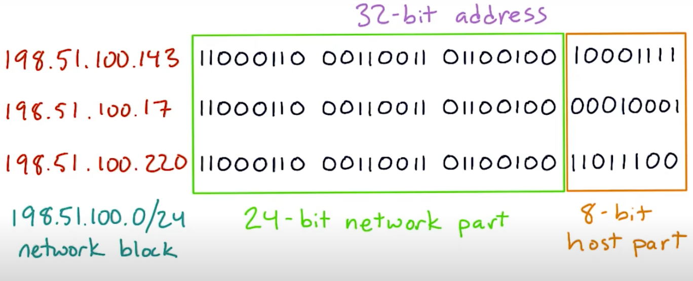
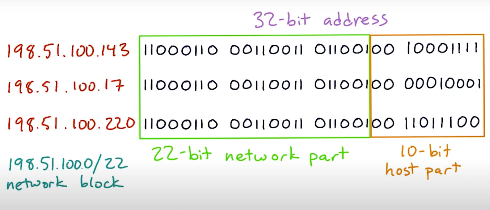

# network blocks

- 특정 network block상의 모든 주소들은 특정 prefix를 공유한다
- 그래서 주소값들은 prefix로 동일하게 시작하고 prefix 뒤에 특정 bit position 부터 값을 서로 달리한다
- 같은 netblock안의 컴퓨터들은 라우터들을 통하지 않고 서로 통신가능
- 네트워크 사이즈에 따라 prefix의 길이가 다름
- prefix가 짧을 수록 더 많은 주소의 호스트들을 배정할 수 있으므로 더 큰 네트워크라고 볼 수 있음



- a network with `24` bit prefix (/24 network)
- host를 위해서는 `8` bit가 남아있음 => 256 (2^8) addresses
- netblock의 top, bottom은 reserved 되어있고 first address는 router의 주소
- 따라서 가용 호스트 주소는 총 `253`개



- a network with `22` bit prefix (/22 network)
- host를 위해서는 `10` bit가 남아있음 => 1024 (2^10) addresses
- netblock의 top, bottom은 reserved 되어있고 first address는 router의 주소
- 따라서 가용 호스트 주소는 총 `1021`개

## netblocks & subnet

- stackoverflow의 한 답변
```
I'm not sure that there is an official definition of "netblock", but in common usage, I've most frequently heard it used in reference to an IP address allocation assigned by an RIR to another organization.

"Subnet", on the other hand, is a more broad networking concept, used when referring to a portion of the IP addresses that are part of a larger network scope.

So, to use these terms together, I will use this fictitious situation:

- ARIN has allocated the 203.0.113.0/24 netblock to MyBigCorporation
- MyBigCorporation needs to subdivide this allocation into smaller subnets for various purposes, so...
- MyBigCorporation allocates 203.0.113.0/28 (a subnet of 203.0.113.0/24) for use by their inbound MXes

REFERENCE: https://serverfault.com/a/799149
```
