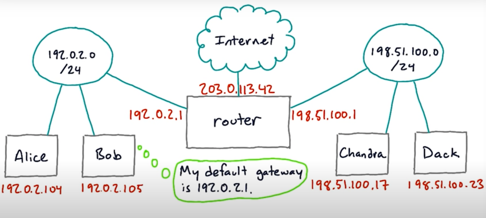
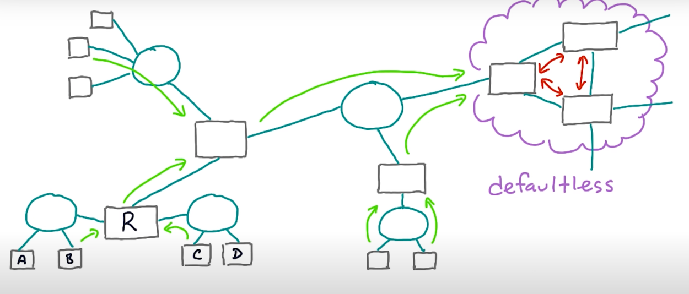
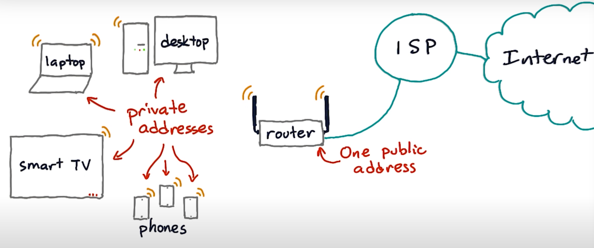
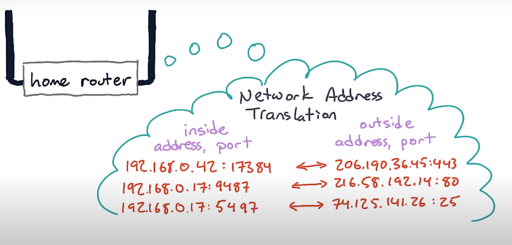

# Router



- a device that connects two different IP networks
- 일종의 게이트웨이
- 한 호스트는 다른 컴퓨터에게 라우터를 통해 traffic을 포워딩 해서 보낸다
- 한 local network (같은 net block)에 존재하는 호스트는 default gateway (router that's connected toward the rest of the internet)에 대한 정보를 알고 있음
- 같은 net block (local, e.g. Alice and Bob)은 라우터를 통할 필요가 없음
- 다른 net block (e.g. Alice and Chandra)는 라우터를 통해야 서로 통신할 수 있음



- default gateway(router)는 (또 다른) default gateway로 연결 될 수 있다
- going toward the rest of the internet
- 최종적으로는 defaultless part에 도달하게 됨
- Defaultless Part: where `routers` on major transit ISPs knows about the `global routing table`, the directory of all public IP networks
- defaultless part의 라우터들은 default gateway가 없음


## NAT (Network Address Translation)


- router는 ISP로부터 single real public IP address를 부여받음
- router는 연결된 기기들에게 각각 private address를 부여함
- 각각의 기기들은 외부 인터넷에 보여지는 것은 하나의 public IP address로 보여짐

- Private address netblocks 예시

```
10.0.0.0 /8
172.16.0.0 /12
192.168.0.0 /16

# 홈 라우터 상에서 가장 흔한 address netblock
192.168.0.0 /16 (internet standard - RFC1918)
default gateway: 192.168.0.1 (수 많은 가능한 private IP address중 한개) 
```



- router는 어떤 내부 prviate address와 port가 어떤 외부 public address와 port로 연결 되어있는지에 대한 맵을 가지고 있음
- private address와 public address간의 전환이 필요할 때 (traffic 발생 시) rewrite 혹은 translate 해줌

- NAT is a workaround, not a solution of IP address shortage
end user가 다른 사람들이 접근할 수 있는 server를 운영하기 쉽지 않음 <br>
end user machine 상에서 돌아가는 network application을 write하고 debug하기 힘듬
  
router는 자신을 거치는 모든 connections를 tracking 해야함
하지만 내 컴퓨터는 자신의 public address를 알 수 없음
hacky extra protocol arrangement 없이는 포워딩하기 쉽지 않음

