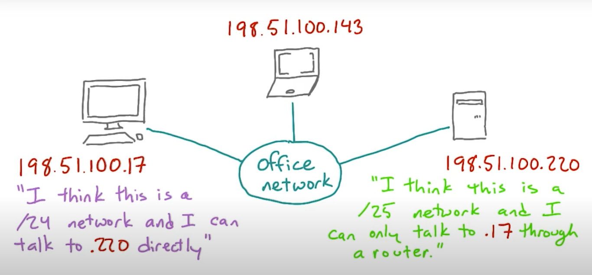
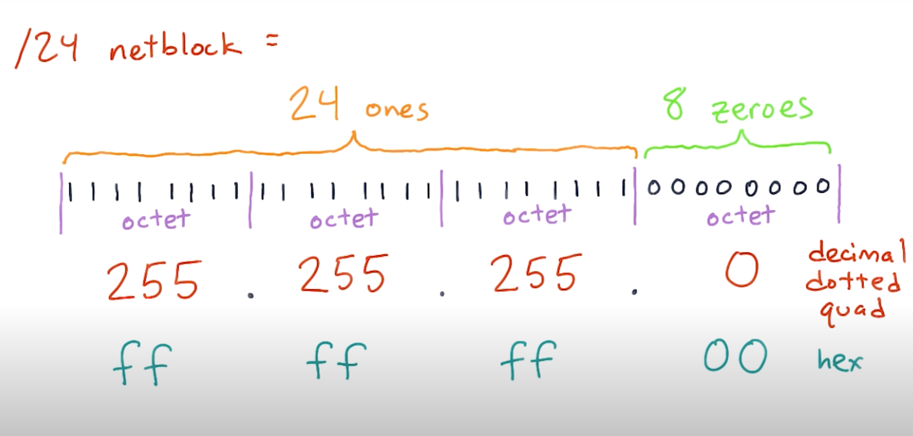
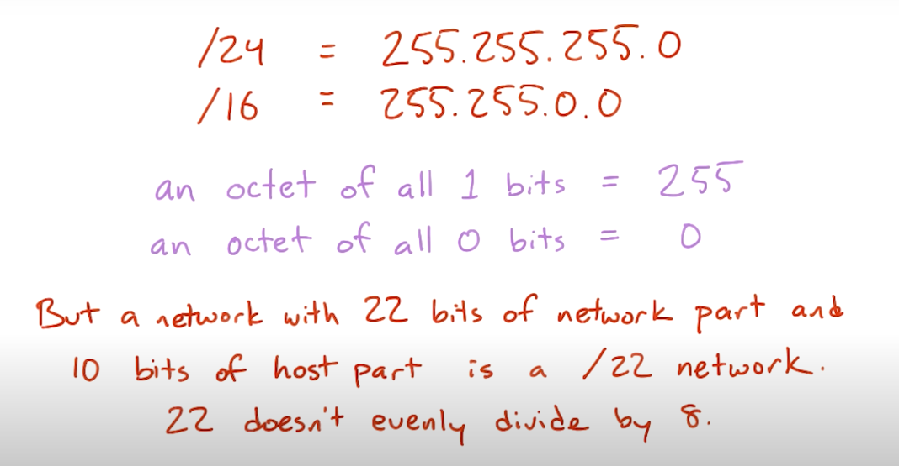
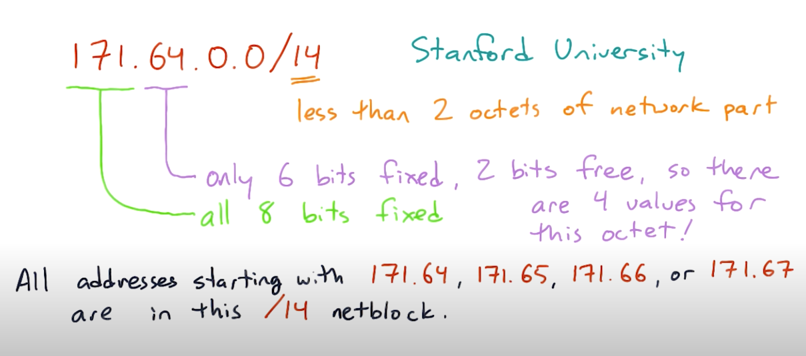

# Subnet

[Subnet wiki](https://ko.wikipedia.org/wiki/%EB%B6%80%EB%B6%84%EB%A7%9D)

## Subnet misconfiguration

- server network상에서 치명적인 장애를 일으킬 수 있다
- 예를들어 한 컴퓨터는 다른 컴퓨터를 같은 netblock내에 존재한다고 생각해서 라우터 없이 바로 통신할 수 있다고 생각하는 반면, 상대 컴퓨터는 통신하는 컴퓨터를 다른 netblock으로 인식해서 라우터를 통해서 통신해야한다고 생각할 수 있음
- 이럴 경우 매우 이상한 통신 문제가 생길 수 있음

## Subnet Mask

- network size를 표현하기 위한 방법 중 하나
- 주로 network configuration에서 사용됨
- ones on the left, zeros on the right -> network size를 나타내기 위함
- /16 netblock의 subnet mask는 `255.255.0.0` 임

## standford's 14

- 할당된 netblock은 chunk 또는 subnet으로 쪼개어 져서 관리 될 수 있다.

  

- prefixes는 꼭 whole octet 사이즈 (8 bits)로 딱 떨어질 필요는 없다 (e.g. /22 netblock, 10 bits of host part)

 
- subnet mask for /14 netblock: `255.252.0.0`
second octet `252`  
= `11111100`  
= 255 (binary `111111`) - 3 (binary `00`)  
  