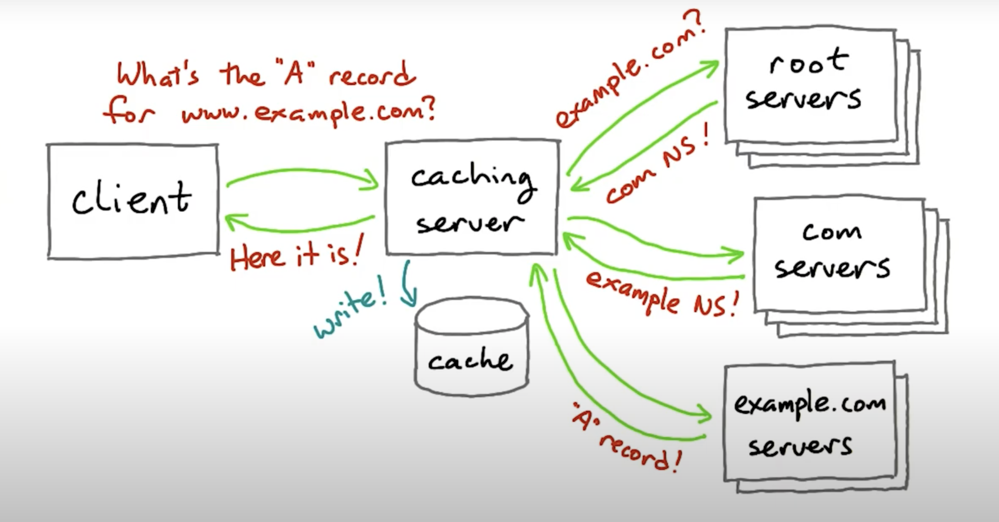

# DNS (Domain Name System)

- Worldwide distributed directory of network information
- 다양한 종류의 record를 저장하고 있음
- Security Mechanisms으로 써의 의의도 있음
  e.g.
  HTTP, including SSL encryption (HTTPS) and cookie privacy

## A-Record (A for Address)
- 가장 잘 알려진 DNS record
- used to find the address of a computer connected to the internet from a name

```
mapping
www.example.net -> IPv4 address (e.g. 93.184.216.34)
```
- client는 이 레코드를 조회해서 web site의 IP address 를 찾아낸다
- web site를 만들었다면 DNS record를 세팅해서 client가 이름으로써 사이트에 접근 가능하도록 만들어줘야함

## Registrar
```
Domain Name -> Registrar -> IP Address
```
- register domain name with a Registrar
- then, pointing the DNS records at the web servers IP addresses
- users can reach the website with domain name

## The Resolver

- The DNS client code build into your operating system
- programmes like netcat, ping or web browsers can just use it

## DNS record types

- CNAME
  Canonical Name (official name)
  used to make an alias for one name to another

- AAAA(quad-A)
  = IPv6 Adrress
  IPv6 equivalent of an A record
  IPv6 address가 IPv4 address보다 4배 더 길기 때문에 붙은 이름

- NS
  DNS name server
  NS record says what DNS servers have the records for that domain

## Distributed DNS with Caching

- client의 resolver는 global master server와 같은 하나의 거대한 server에게 record를 물어보지않는다
- resolver는 가장 가까이 위치한 caching DNS server에게 물어본다
  e.g.
  home user - local home router, ISP, Google Public DNS

### DNS caching server



- client로부터 요청이 들어오면 우선 local cache를 뒤져서 record를 찾아본다
- record를 찾지못하면 적절한 nameservers로 쿼리를 포워딩 해준다
- root server (example.com?) -> answer: com NS -> top level domain -> answer: example NS -> lower level domain -> … -> answer
- query에 상응하는 결과를 cache에 저장해서 같은 요청이 들어왔을 때, 다시 같은 과정을 반복하지 않도록 함

문제점:
IP Address를 옮기고 싶을 때 cache에 저장되어있는 IP Address는 deprecated 됨

- 그래서 DNS records는 Time To Live (TTL) 속성이 있음
- 얼마동안 cache를 유지할지

```
$ dig udacity.com

; <<>> DiG 9.11.3-1ubuntu1.15-Ubuntu <<>> udacity.com
;; global options: +cmd
;; Got answer:
;; ->>HEADER<<- opcode: QUERY, status: NOERROR, id: 16509
;; flags: qr rd ra; QUERY: 1, ANSWER: 4, AUTHORITY: 0, ADDITIONAL: 1

;; OPT PSEUDOSECTION:
; EDNS: version: 0, flags:; udp: 65494
;; QUESTION SECTION:
;udacity.com.			IN	A

;; ANSWER SECTION:
udacity.com.		60	IN	A	52.84.166.67
udacity.com.		60	IN	A	52.84.166.82
udacity.com.		60	IN	A	52.84.166.108
udacity.com.		60	IN	A	52.84.166.43

;; Query time: 46 msec
;; SERVER: 127.0.0.53#53(127.0.0.53)
;; WHEN: Sun Jun 27 07:31:13 UTC 2021
;; MSG SIZE  rcvd: 104
```

- 위의 예시에서 60이 TTL

