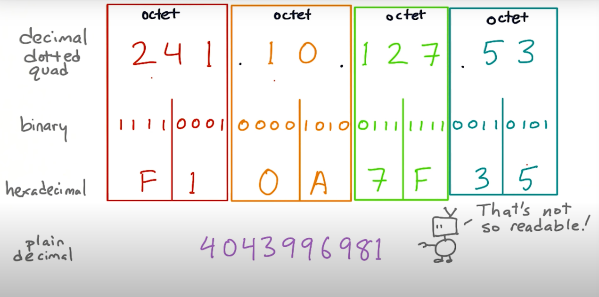

# IPv4 & IPv6

- IPv4: 오늘날의 대부분의 인터넷 트래픽이 사용하는 옛날 버젼 IP

```
# IPv4 예시
216.58.217.206

# IPv6 예시
2607:f8b0:4007:0804:0000:0000:0000:1006
```



- IPv4 Address는 4개의 숫자가 `.`으로 나누어진 채로 4번 적힌 형태를 가짐
- 각 4개의 숫자는 1 byte, octet 혹은 8-bits
- total 32-bits, 4 bytes or 4 octets (octest: specifically 8 bits. this is for old computers that use different sizes of bytes)
- 그래서 한 블록의 숫자는 0~255사이의 숫자가 될 수 있음 (binary)
- IPv4 Address has a bit width of 32 (it has 32-bits wide): 32 bits are used to represent the value

## Bits

- network 상에서 숫자라는 것은 더하기나 곱하기 같은 계산을 위한 숫자들이 아니다
- 주소나 우편번호와 같이 `비교`를 위한 것임
- 만약 3 bit long network가 있다면 그 네트워크 상에는 최대 8개의 머신 (주소)가 존재할 수 있음

## port number의 최대는 65535

- 65535보다 높은 port number에 connect할 수 없는 이유는 packet header의 port number space가 16-bits wide이기 때문


